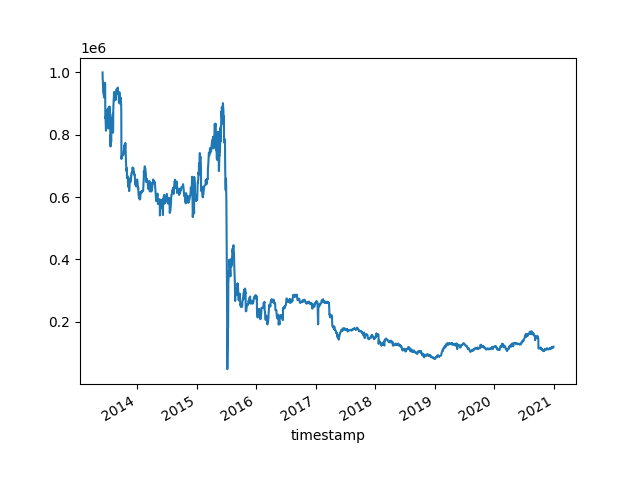

# 因子设计逻辑
根据股票的过去一个月的日k数据,
归一化之后计算股票之间的相似度,
对每只股票选取相似度前10求和
计算牵引度因子.

# 回测效果

在2012-06-03至2020-12-31, 在A股市场
上回测, 按月调仓, 不考虑交易成本. 
选取牵引度因子最小的10只股票,
等权持有. 回测结果:

最大回撤: 0.9520826178649139

夏普比率: 0.02755227357756279

年化收益率: -0.11602631046289226

